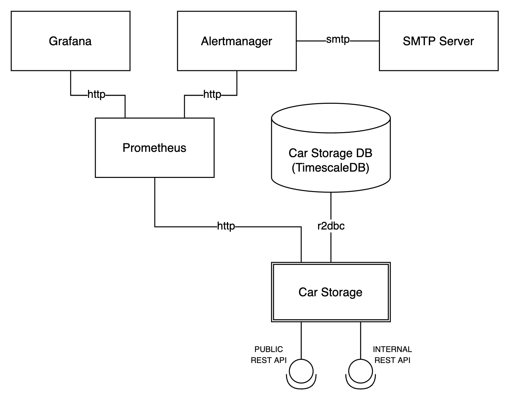
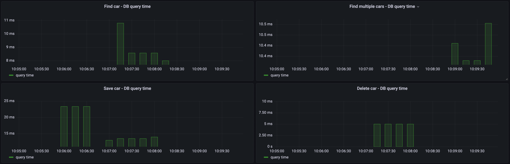
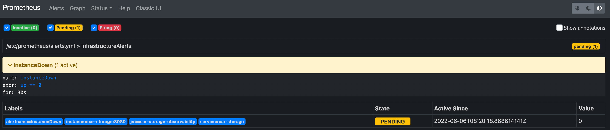
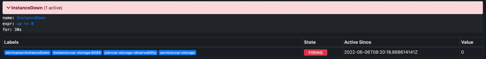
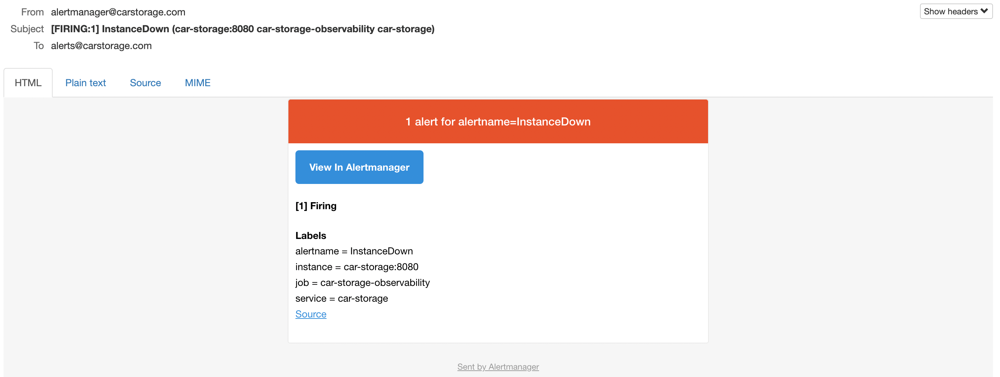

# Modern Java Microservice - Car Storage

Car Storage is a service responsible for storing cars data.
It is an example of a modern, reactive and lightweight microservice written with Java. 

- Creator: Damian Śniatecki (https://www.linkedin.com/in/damiansn/)
- Stage: early development
- Version: 0.3.0

Car storage is written in a reactive paradigm. It makes it ideal for low-latency, high-throughput workloads.
Additionally, its public API is secured by JWT token. Such token can be generated by an OAuth2 & OpenId connect provider 
(e.g. Keycloak). 

Technologies used:

- JVM 17
- Maven 3.8.4
- Spring Boot 2.6.7 (Webflux)
- Spring Data R2DBC (+ PostgreSQL R2DBC drivers)
- Testcontainers 1.17.1 (+ JUnit, Mockk)
- OpenApi
- PostgreSQL 14
- Docker 20.10.12
- Prometheus 2.33.3
- Grafana 8.2.6
- Alertmanager 0.23.0

Architecture:

Monitoring:

- JVM metrics

- Car Storage custom metrics

Alerts:

- alert pending

- alert firing

- Instance down mail message

Docker Hub:

https://hub.docker.com/u/dsniatecki

- Car Storage: https://hub.docker.com/r/dsniatecki/car-storage

How to start the system:

1. Clone repo
2. Execute: docker-compose -f docker-compose-0.3.0.yml up